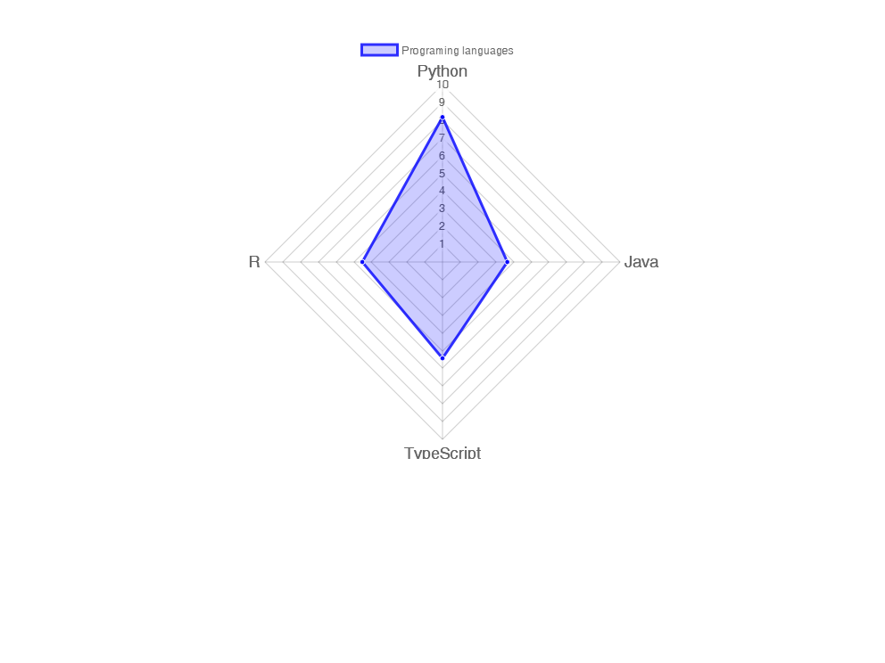
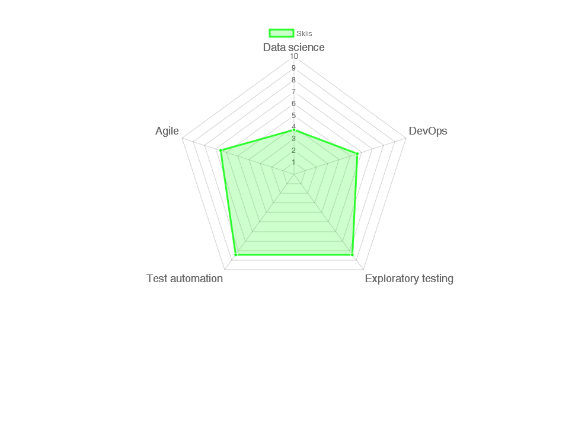

---
output:
  pdf_document: 
    keep_md: true
  html_document: default
  md_document:
    variant: markdown_github
urlcolor: blue
geometry: margin=1.5cm
fontsize: 11pt
---
# Tomasz Dworowy
\noindent\makebox[\linewidth]{\rule{\paperwidth}{1pt}}

Email
Phone   
[LinkedIn](https://linkedin.com/in/tomasz-dworowy-aab283bb)  
[Hackerrank](https://www.hackerrank.com/dworowytomasz)  
[Github](https://github.com/tdworowy)  

\noindent\makebox[\linewidth]{\rule{\paperwidth}{1pt}}

\large
Software tester, adherent of context driven testing school, specialize in test automation (functional and performance). Python enthusiast but capable to use and open to learn different languages to. Professionally interested in DevOps, Agile, data science and machine learning, personally in history, philosophy and economics. \par 
\noindent\makebox[\linewidth]{\rule{\paperwidth}{1pt}}

## Company: FLYR Labs   

Time span: June 2021 - Current  
Position: Software Engineer in Test 

\noindent\makebox[\linewidth]{\rule{\paperwidth}{1pt}}

## Company: Sii  

Time span: June 2019 - June 2021  
Position: Test Development Engineer

### Client: Roche

Time span: December 2020 - June 2021 

### Project: 
Data pipeline - goal of project is to prepare data pipeline from salesforce, to AWS S3 bucket which transform data and make it ready to use in ThoughtSpot.

#### Responsibilities:

* Testing (SQL)
* Test automation (Python)

**Tools used**: Python, SQL, AWS glue, AWS Athena.  
**Project Management Methodology**: Scrum.

### Client: ING Tech Poland

Time span: May 2020 - September 2020

#### Project:

Credit cards backoffice application.

#### Responsibilities:

* Test automation (Java)
* Testing (GUI, API and data base)

**Tools used**: Java, Oracle SQL Developer, Postman.  
**Project Management Methodology**: Scrum.

### Client: Grand parade (William Hill) 

Time span: October 2019 to March 2020

#### Project:

Data ingestion – goal of project was to prepare data pipeline from mssql, through S3 bucket, to Snowflake database. Pipeline was prepare using Airflow and NiFi.

#### Responsibilities:  

* Test automation (Python and Pytest)
* Test case design
* Testing
* Development support  
  
**Tools used**: Python, Pytest, Snowflake, Airflow, Nifi, SQL, Jira, Git, Docker, Terraform.  
**Project Management Methodology**: Scrum.

### Client: ABB 

Time span: July 2019 to September 2019

#### Project:

ServIS 2.0 Proof of technology - goal of project was to test performance of mssql data base (and simple REST api) located in Azure cloud.  

#### Responsibilities:  

* REST api functional testing using Postman
* Data base performance testing using Jmeter
* REST api performance testing using Jmeter
* Preparation of reports using Power BI and Excel  

**Tools used**: Jmeter, Power BI, Postman, Azure, SQL  
**Project Management Methodology**: Scrum.

\noindent\makebox[\linewidth]{\rule{\paperwidth}{1pt}}

## Company: Rockwell Automation  

Time span: September 2017 – April 2019  
Position: Software Test Engineer

#### Project:

Emulate - Industrial controller emulator, goal of project was to re-use part of industrial controller firmware to prepare emulator for windows 10. Product should be able to emulate multiple controllers as well as communication between them.  

#### Responsibilities:

* Functional testing
* Test automation (Python)
* Development of Python API (via NATS) of emulated controller
* Python and C# unit tests
* Tech spikes and documentation
* Jenkins pipeline configuration and maintenance  

**Tools used**: Python, C#, C++, Git, Docker, Jenkins, IBM RQM, google protobuf, NATS message broker.  
**Project Management Methodology**: Scrum and SAFe.

\noindent\makebox[\linewidth]{\rule{\paperwidth}{1pt}}

## Company: Alan Systems  

Time span: December 2013 - September 2017  
Position: Software Tester

#### Projects: 
ATMS Watch (12.2013 – 12.2014) - Web time tracking application use to track working time, including time shift, vacations, sick leave etc.  
CREAM (12.2014 – 09.2017) - Customer relationship management web application use to create and coordinate marketing campaigns and to manage customer and products base. 

#### Responsibilities:  

* Functional exploratory testing
* Test automation written in Java using selenium webdriver and JUnit
* Automation of rest API tests written in Java
* Performance and load tests using Jmeter and Java framework

**Tools used**: Selenium webdriver, Jmeter, Docker, Jenkins, Git, Jira, TestLink, SQL.  
**Project Management Methodology**: Scrum.  

\noindent\makebox[\linewidth]{\rule{\paperwidth}{1pt}}

# Education

## University of Economics in Katowice  

* Time span: 2015 – 2018
* The Faculty: Informatics
* Level of education: master
* Specialization: Analysis of large data sets
* Master thesis topic: *Methods, techniques and tools for automated testing in the software development process*

 
## University of Economics in Katowice

* Time span: 2010 – 2013
* The Faculty: Informatics
* level of education: bachelor
* Specialization: Databases and data warehouses
* Bachelor thesis topic: *Suggestions for the use of artificial neural networks in the classification of bonds*

\noindent\makebox[\linewidth]{\rule{\paperwidth}{1pt}}

# Programing languages

<!-- --> 
\newpage

# skills

<!-- --> 

\noindent\makebox[\linewidth]{\rule{\paperwidth}{1pt}}

# Courses

* ISTQB Foundation Level, certificate: 57418
* Machine Learning, Coursera, certificate: [R4LDP4UJKNW5](https://www.coursera.org/account/accomplishments/records/R4LDP4UJKNW5)
* Ancient Philosophy: Aristotle and His Successors, Coursera, certificate: [SJH4XTG8ZC89](https://www.coursera.org/account/accomplishments/records/SJH4XTG8ZC89)
* Kubernetes Essentials, Linux Academy, certificate: [194408](https://linuxacademy.com/profile/u/cert/id/194408)
* Implementing a Full CI/CD Pipeline, Linux Academy, certificate: [197992](https://linuxacademy.com/profile/u/cert/id/197992)
* Learning Full-Stack JavaScript Development: MongoDB, Node, and React, Linkedin
* Introduction to Discrete Mathematics for Computer Science (specialization), Coursera, certificate: [SB2ADSZH9GXJ](https://www.coursera.org/account/accomplishments/specialization/SB2ADSZH9GXJ)
* Introduction to Complexity, Santa Fe Institute(complexityexplorer.org), certificate:[226951170](https://www.complexityexplorer.org/courses/104-introduction-to-complexity/certificates/226951170)
* Data Science(specialization), Coursera, certificate: [TDQ6CJ9NT7ZX](https://www.coursera.org/account/accomplishments/specialization/TDQ6CJ9NT7ZX)

\noindent\makebox[\linewidth]{\rule{\paperwidth}{1pt}}

\scriptsize Wyrażam zgodę na przetwarzanie moich danych osobowych dla potrzeb niezbędnych do realizacji procesu rekrutacji zgodnie z Rozporządzeniem Parlamentu Europejskiego i Rady (UE) 2016/679 z dnia 27 kwietnia 2016 r. w sprawie ochrony osób fizycznych w związku z przetwarzaniem danych osobowych i w sprawie swobodnego przepływu takich danych oraz uchylenia dyrektywy 95/46/WE (RODO).\par
